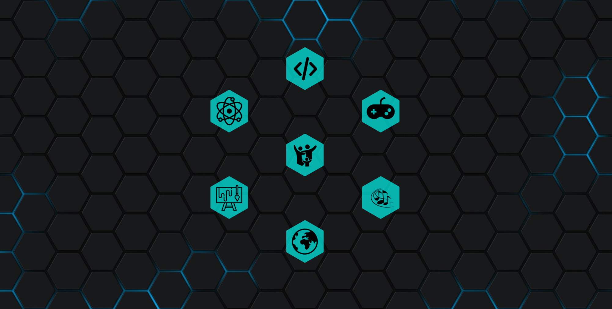

<h1> 🎸 Hello welcome to my Github! 💻 </h1>

    

            My preferred name is Irael. I'm from Texas and have recently discovered that I have a passion for software development! I have a bachelor's in Mathematics and a background in Business Management. I recently graduated from Flatiron School, which was one of the best decisions I've made in my life. I love solving puzzles and strategically thinking to create solutions. I am a science enthusiast, escpecially in the fields of physics and psychology. 
    

    🛠 Under construction as a Software Developer.
 
    🤖 Working on deploying my first app!
     
    🤯 Currently learning React Redux, OmniAuth and Devise 
 
    😁 Love to play video games, play the guitar/piano, draw and Code!
 
    😊 Feel free to reach out!

<h2> Languages and Tools: </h2>

    <h2>Blogs</h2>

### Connect with me

    <h2> Connect with me!</h2>
     
    <svg role="img" viewBox="0 0 24 24" xmlns="http://www.w3.org/2000/svg"><title>LinkedIn</title><path d="M20.447 20.452h-3.554v-5.569c0-1.328-.027-3.037-1.852-3.037-1.853 0-2.136 1.445-2.136 2.939v5.667H9.351V9h3.414v1.561h.046c.477-.9 1.637-1.85 3.37-1.85 3.601 0 4.267 2.37 4.267 5.455v6.286zM5.337 7.433c-1.144 0-2.063-.926-2.063-2.065 0-1.138.92-2.063 2.063-2.063 1.14 0 2.064.925 2.064 2.063 0 1.139-.925 2.065-2.064 2.065zm1.782 13.019H3.555V9h3.564v11.452zM22.225 0H1.771C.792 0 0 .774 0 1.729v20.542C0 23.227.792 24 1.771 24h20.451C23.2 24 24 23.227 24 22.271V1.729C24 .774 23.2 0 22.222 0h.003z"/></svg>
    - LinkedIn
     
    - Medium
     
    - Portfolio
     
    - Twitter
     
    📧 jeisgar13@gmail.com

